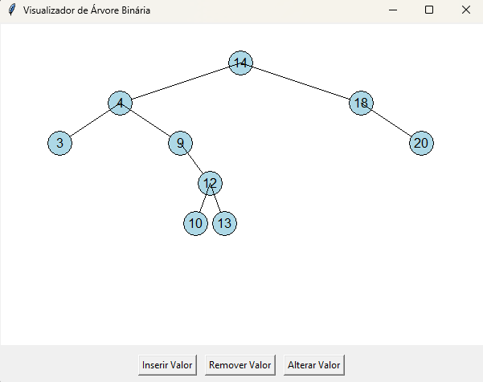

# 🌳 BinaryTree - Visualizador de Árvore Binária

## 📌 Sobre o Projeto
Este projeto é uma aplicação gráfica simples desenvolvida em Python com a biblioteca Tkinter. 
Ele permite inserir, remover e alterar valores em uma árvore binária de busca (BST), 
visualizando as mudanças em tempo real através de uma interface gráfica intuitiva.

## 🛠️ Tecnologias Utilizadas
- Python 3.x → Linguagem de programação utilizada
- Tkinter → Biblioteca para criação de interfaces gráficas
- O projeto é executado de forma local, sem dependências externas além da própria linguagem.

## ⚙️ Funcionalidades
✅ Inserção de nós na árvore binária
✅ Remoção de nós da árvore
✅ Alteração de um valor existente por um novo
✅ Visualização gráfica da estrutura da árvore binária

## 🏗️ Estrutura Interna
- `Node`: Representa um nó da árvore.
- `BinaryTree`: Implementa a lógica da árvore binária de busca (inserção, busca, remoção).
- `TreeGUI`: Interface gráfica que utiliza Tkinter para interação com o usuário e visualização da árvore.

## 📸 Capturas de Tela

